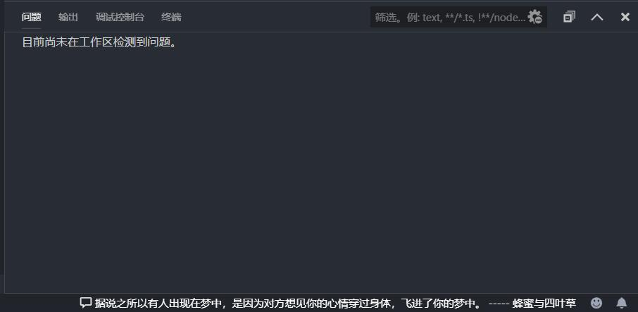

# hitoko

> [一言网](https://hitokoto.cn/)(Hitokoto.cn)创立于2016年，隶属于萌创Team，目前网站主要提供一句话服务。

此插件为Hitokoto的**非官方**插件,提供vscode中一言的功能

## 示例

* 启动vscode,以及每间隔一段时间,状态栏会显示一言,点击状态栏可以打开浏览器进入一言网对应的条目
* 间隔时间可在设置中配置

## 配置

* `hitokoto.api`
    hitokoto的接口地址, 可参考此页面:[https://hitokoto.cn/api](https://hitokoto.cn/api)
* `hitokoto.autoStart`
    是否启动时自动展示

* `hitokoto.intervalShow`
    是否间隔展示 (default:**true**)

* `hitokoto.intervalTime`
    间隔展示时间(单位:分钟) (default:**30**)

